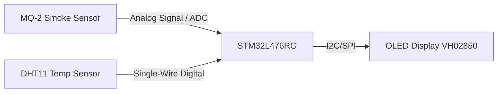
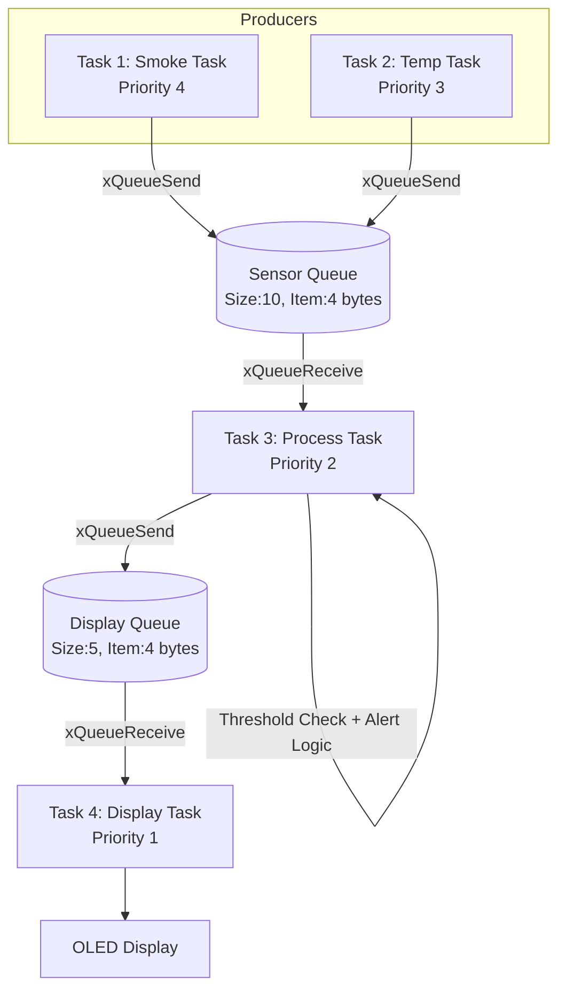
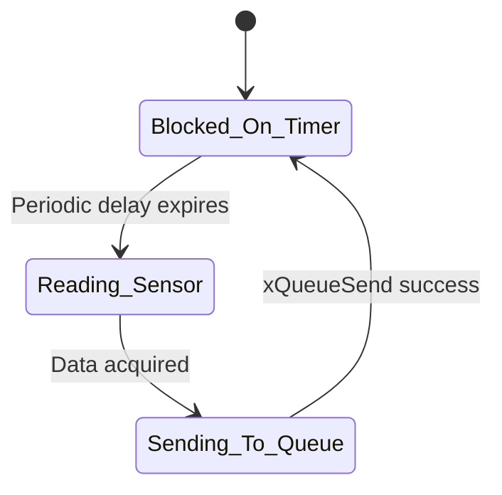
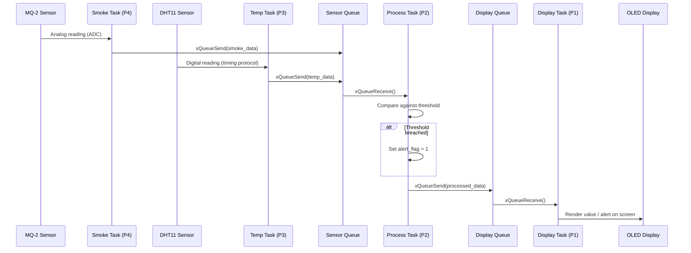
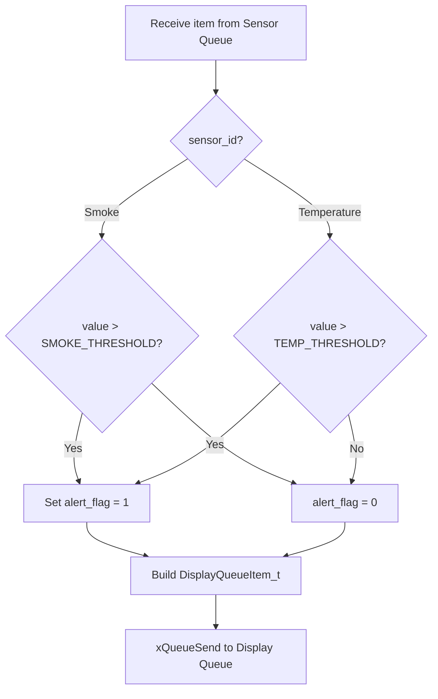

# Environment Monitoring System — System Design Architecture

## 1. Overview

This document describes the software architecture of an **Environment Monitoring System** built on the **STM32L476RG** microcontroller, developed using **STM32CubeIDE / STM32CubeMX**, **HAL drivers**, and **FreeRTOS** as the real-time operating system.

The system continuously monitors ambient smoke levels and temperature, evaluates the readings against safety thresholds, raises alerts when thresholds are breached, and displays live data on an OLED screen. The design follows a **multi-task, queue-based producer–consumer architecture**, which decouples sensor acquisition from data processing and display rendering.

---

## 2. Hardware Architecture

| Component | Model | Interface | Role |
|---|---|---|---|
| MCU | STM32L476RG | — | Main controller, runs FreeRTOS |
| Smoke Sensor | MQ-2 | Analog (ADC) | Detects smoke/gas concentration |
| Temperature Sensor | DHT11 | Single-wire digital (GPIO, timing-based) | Detects ambient temperature (and humidity) |
| Display | OLED VH02850 | I2C / SPI (per board config) | Displays live sensor data and alerts |

### 2.1 High-Level Hardware Block Diagram



---

## 3. Software Architecture

The application is structured as **four FreeRTOS tasks** communicating through **two message queues**. This isolates sensor I/O timing from processing logic and display rendering, ensuring that a slow or blocking sensor read does not stall the rest of the system.

### 3.1 Architectural Style

- **Pattern**: Producer–Consumer with a central Process/Aggregator task
- **Concurrency Model**: Preemptive, priority-based scheduling (FreeRTOS)
- **Communication**: FreeRTOS Queues (no shared global state / no mutexes required for sensor data path)
- **Decoupling**: Sensor tasks never talk to the Display task directly — all data flows through the Process task

### 3.2 System Architecture Diagram



---

## 4. Task Design

FreeRTOS tasks are prioritized so that **data acquisition (sensing) always preempts processing and display**, ensuring no sensor sample is missed due to slower downstream operations.

| Task | Priority | Stack (words) | Function |
|---|---|---|---|
| **Task 1 — Smoke Task** | 4 (Highest) | 128 | Reads MQ-2 analog value via ADC, pushes raw/converted value to Sensor Queue |
| **Task 2 — Temp Task** | 3 | 128 | Reads DHT11 temperature via single-wire timing protocol, pushes value to Sensor Queue |
| **Task 3 — Process Task** | 2 | 128 | Reads from Sensor Queue, applies threshold logic, raises alerts, forwards processed data to Display Queue |
| **Task 4 — Display Task** | 1 (Lowest) | 128 | Reads from Display Queue, renders values/alerts on OLED |

**Priority rationale:**
- Smoke detection (Task 1) is safety-critical and time-sensitive → highest priority.
- Temperature acquisition (Task 2) is important but less time-critical than gas/smoke detection.
- Processing (Task 3) can tolerate slight delay since it only reacts to queued data.
- Display rendering (Task 4) is the least time-critical — a few milliseconds of UI lag is acceptable.

### 4.1 Task State / Behavior Diagram



---

## 5. Inter-Task Communication (Queues)

Two FreeRTOS queues form the backbone of inter-task communication, ensuring **thread-safe, decoupled data transfer** without direct task coupling.

### 5.1 Sensor Queue

| Property | Value |
|---|---|
| Purpose | Carries raw sensor data from Task 1 (Smoke) and Task 2 (Temp) to Task 3 (Process) |
| Queue Length | 10 |
| Item Size | 4 bytes (e.g., `uint32_t` or a packed struct) |
| Producers | Task 1 (Smoke), Task 2 (Temp) |
| Consumer | Task 3 (Process) |
| API Used | `xQueueSend()` / `xQueueSendToBack()` (Producers), `xQueueReceive()` (Consumer) |

> **Note:** Since two producer tasks write to the same queue, the item structure/format should indicate the data source (e.g., tag the value or use a small struct with a `sensor_id` field) so the Process Task can distinguish smoke data from temperature data.

**Suggested Queue Item Structure:**
```c
typedef struct {
    uint8_t  sensor_id;   // 0 = Smoke, 1 = Temperature
    uint16_t value;       // Sensor reading
    uint8_t  reserved;    // Padding to keep struct at 4 bytes
} SensorQueueItem_t;
```

### 5.2 Display Queue

| Property | Value |
|---|---|
| Purpose | Carries processed data/alert status from Task 3 (Process) to Task 4 (Display) |
| Queue Length | 5 |
| Item Size | 4 bytes |
| Producer | Task 3 (Process) |
| Consumer | Task 4 (Display) |
| API Used | `xQueueSend()` (Producer), `xQueueReceive()` (Consumer) |

**Suggested Queue Item Structure:**
```c
typedef struct {
    uint8_t  data_type;   // 0 = Smoke, 1 = Temperature, 2 = Alert
    uint16_t value;       // Value to display
    uint8_t  alert_flag;  // 1 = Threshold breached
} DisplayQueueItem_t;
```

### 5.3 Data Flow Sequence Diagram



---

## 6. Threshold & Alert Logic (Process Task)

The Process Task (Task 3) is the "brain" of the system:

1. Blocks on `xQueueReceive()` from the Sensor Queue (with timeout, e.g., `portMAX_DELAY` or a defined wait period).
2. Identifies data source (`sensor_id`).
3. Compares the reading against a predefined threshold:
   - `SMOKE_THRESHOLD` for MQ-2 readings
   - `TEMP_THRESHOLD` for DHT11 readings
4. If the value exceeds the threshold → sets `alert_flag = 1` in the outgoing packet (and optionally triggers a buzzer/LED GPIO directly from this task).
5. Packs the result into a `DisplayQueueItem_t` and sends it via `xQueueSend()` to the Display Queue.



---

## 7. Memory Configuration

| Resource | Configuration |
|---|---|
| FreeRTOS Heap (`configTOTAL_HEAP_SIZE`) | 16384 bytes |
| Stack per task | 128 words (512 bytes on 32-bit STM32L4) |
| Total task stack usage (4 tasks) | 4 × 512 = 2048 bytes |
| Sensor Queue memory | 10 items × 4 bytes = 40 bytes (+ queue control block overhead) |
| Display Queue memory | 5 items × 4 bytes = 20 bytes (+ queue control block overhead) |

**Heap budget check:** Task stacks (2048 B) + Queue storage (~60 B + overhead) + Queue/Task control blocks (TCBs) leave sufficient headroom within the 16 KB heap for FreeRTOS kernel objects, provided `heap_4.c` (or similar) is used for the memory allocation scheme.

> **Recommendation:** Monitor actual stack usage with `uxTaskGetStackHighWaterMark()` during testing — DHT11's bit-banged timing routine and OLED driver calls (which may use local buffers) are the most likely candidates to run stack-tight at 128 words.

---

## 8. Timing Considerations

| Task | Typical Read Interval | Notes |
|---|---|---|
| Smoke Task | Fast polling (e.g., every 500 ms–1 s) | ADC read is quick; higher priority ensures timely capture |
| Temp Task | Slower (e.g., every 1–2 s) | DHT11 has a minimum ~1 s sampling interval per datasheet; single-wire protocol is timing-sensitive and should ideally disable interrupts briefly during bit-banging |
| Process Task | Event-driven | Wakes only when Sensor Queue has data |
| Display Task | Event-driven | Wakes only when Display Queue has data |

**Critical timing note:** DHT11's communication protocol relies on precise microsecond-level delays. Since Task 2 runs at Priority 3 (below the Smoke Task), ensure the smoke task's execution time is short enough that it doesn't repeatedly delay DHT11's bit-banging window beyond the sensor's tolerance. If timing issues occur, consider:
- Using a hardware timer/DWT cycle counter for DHT11 bit timing instead of relying purely on task scheduling, or
- Temporarily raising Task 2's priority during the active read window.

---

## 9. Error Handling & Robustness

| Failure Mode | Handling Strategy |
|---|---|
| Sensor Queue full (`xQueueSend` fails) | Use a short timeout instead of `portMAX_DELAY`; drop/log the sample rather than blocking the producer task indefinitely |
| Display Queue full | Same as above — Process Task should not block indefinitely on a full Display Queue |
| DHT11 checksum/timeout failure | Retry once; if failure persists, send a "sensor error" code through the Sensor Queue instead of a stale value |
| MQ-2 out-of-range ADC reading | Clamp/validate value before queuing |
| OLED I2C/SPI NACK or timeout | Display Task should catch HAL error return codes and retry or skip the current frame rather than crashing |

---

## 10. Directory / Module Structure (Suggested)

```
Project/
├── Core/
│   ├── Src/
│   │   ├── main.c
│   │   ├── freertos.c
│   │   ├── tasks/
│   │   │   ├── smoke_task.c
│   │   │   ├── temp_task.c
│   │   │   ├── process_task.c
│   │   │   └── display_task.c
│   │   ├── drivers/
│   │   │   ├── mq2_driver.c
│   │   │   ├── dht11_driver.c
│   │   │   └── oled_driver.c
│   │   └── stm32l4xx_hal_msp.c
│   └── Inc/
│       ├── tasks/
│       ├── drivers/
│       └── app_config.h        # thresholds, queue sizes, priorities
├── Drivers/                    # HAL + CMSIS (CubeMX generated)
└── SYSTEM_DESIGN.md
```

---

## 11. Configuration Summary Table

| Parameter | Value |
|---|---|
| RTOS | FreeRTOS |
| Heap Size | 16384 bytes |
| Task Stack Size (each) | 128 words |
| Sensor Queue Length / Item Size | 10 / 4 bytes |
| Display Queue Length / Item Size | 5 / 4 bytes |
| Task 1 (Smoke) Priority | 4 |
| Task 2 (Temp) Priority | 3 |
| Task 3 (Process) Priority | 2 |
| Task 4 (Display) Priority | 1 |

---

## 12. Future Enhancements

- Add a **watchdog timer** to recover from a hung DHT11 bit-banging loop.
- Introduce a **humidity reading path** (DHT11 also provides humidity) if needed for display.
- Add a **buzzer/LED alert task** or GPIO trigger directly from the Process Task for immediate physical alerting alongside the OLED indication.
- Consider **low-power tick-less idle mode** on the STM32L4 (well-suited for low-power monitoring applications) between sensor polling cycles.
- Add **data logging** (e.g., via UART to a host, or SD card) for historical trend analysis.

---

## 13. Summary

This architecture uses a clean **producer–consumer pipeline** with FreeRTOS queues to decouple sensor acquisition (Smoke, Temperature) from data processing (threshold/alert logic) and presentation (OLED display). Priority assignment ensures safety-critical smoke detection is never starved, while the Process and Display tasks handle non-time-critical aggregation and rendering work at lower priorities. The design is modular, memory-budget-conscious, and extensible for future sensors or output channels.
